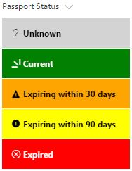

# Conditional formatting based on Passport Status text value
## Summary
The following example shows a different color and icon based on the passport status. The passport status, and the respective color(Hex value) and [Office UI Fabric](https://developer.microsoft.com/en-us/fabric#/styles/icons) icon are listed below:

* **Current** (Color: Green #008000 - Icon: Glimmer)
* **Expiring within 30 days** (Color: Yellow #FFA500 - Icon: IncidentTriangle)
* **Expiring within 90 days** (Color: Orange #FFFF00 - Icon: AlertSolid)
* **Expired** (Color: Red #FF0000 - Icon: ErrorBadge)
* **Unknown** (Color: Grey #D3D3D3 - Icon: Help)

Note: the color of text changes based on the passport status. For example, the text is White for Current and Expired status, but then it's Black for the other statuses.

## Screenshot

## Sample
Solution|Author(s)
--------|--------
passport-status-conditional-format.json | Fausto Capellan, Jr

## Version History
Version|Date|Comments
-------|----|--------
1.0| December 13, 2017 | Initial Release

## Disclaimer
**THIS CODE IS PROVIDED *AS IS* WITHOUT WARRANTY OF ANY KIND, EITHER EXPRESS OR IMPLIED, INCLUDING ANY IMPLIED WARRANTIES OF FITNESS FOR A PARTICULAR PURPOSE, MERCHANTABILITY, OR NON-INFRINGEMENT.**
